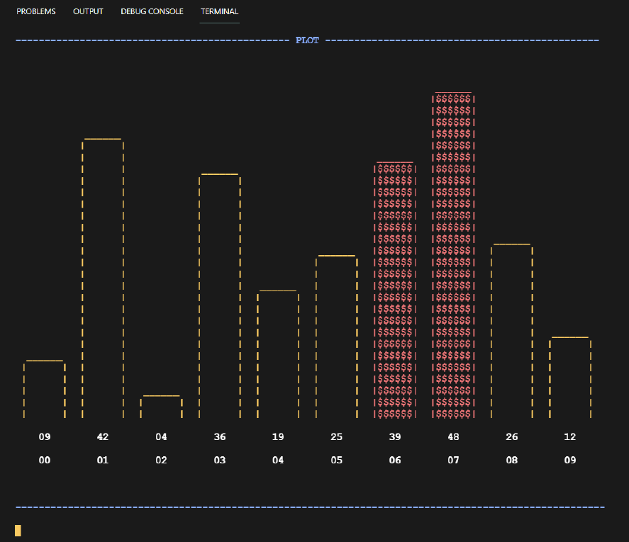

# Sort Visualizer

## Heap and Merge Sort Visualized in terminal

- Run it with Windows Powershell, a windows based header file has been used

```
   g++ main.cpp heap.cpp merge.cpp
```

- Once we obtain the executable file (a.exe)

```sh
   ./a
```

## Screenshot


